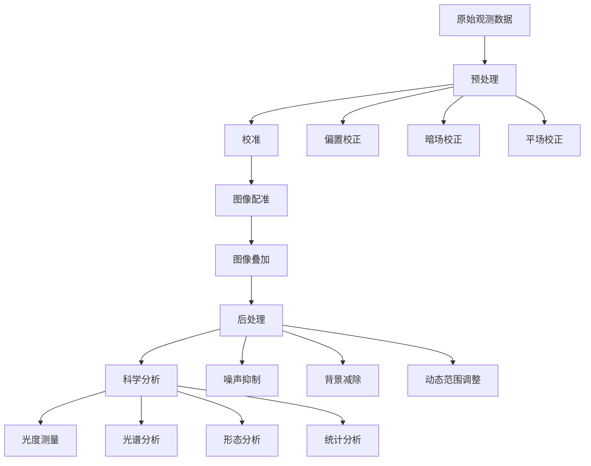

## 天文数据处理的挑战与流程

天文观测产生的数据通常具有以下特点：体积大、信噪比低、受多种系统和环境因素影响。将这些原始数据转化为有科学价值的结果，需要一系列复杂的处理步骤。本文将介绍天文数据处理的完整流程，并提供实用的Python代码示例。

### 数据处理流程概述



## 1. 预处理：校准原始数据

预处理是天文数据处理的第一步，目的是去除仪器和环境引入的系统误差。

### 偏置、暗场和平场校正

```python
import numpy as np
from astropy.io import fits

def calibrate_image(raw_image, bias_frame, dark_frame, flat_field, exposure_time):
    """对原始图像进行基本校准
    
    参数:
    raw_image -- 原始图像数据
    bias_frame -- 偏置帧
    dark_frame -- 暗场帧
    flat_field -- 平场帧
    exposure_time -- 曝光时间（秒）
    
    返回:
    calibrated_image -- 校准后的图像
    """
    # 1. 减去偏置帧
    debias_image = raw_image - bias_frame
    
    # 2. 减去暗场（按曝光时间缩放）
    dark_scaled = dark_frame * (exposure_time / dark_frame_exposure_time)
    dark_subtracted = debias_image - dark_scaled
    
    # 3. 平场校正（归一化平场）
    normalized_flat = flat_field / np.median(flat_field)
    calibrated_image = dark_subtracted / normalized_flat
    
    # 4. 处理异常值
    # 将无穷大和NaN值替换为0
    calibrated_image[~np.isfinite(calibrated_image)] = 0
    
    return calibrated_image

# 使用示例
def process_observation_set(raw_files, bias_file, dark_file, flat_file):
    """处理一组观测数据"""
    # 加载校准帧
    bias_frame = fits.getdata(bias_file)
    dark_frame = fits.getdata(dark_file)
    dark_header = fits.getheader(dark_file)
    dark_frame_exposure_time = dark_header['EXPTIME']
    flat_field = fits.getdata(flat_file)
    
    calibrated_images = []
    
    # 处理每个原始图像
    for raw_file in raw_files:
        # 加载原始图像
        raw_data = fits.getdata(raw_file)
        raw_header = fits.getheader(raw_file)
        exposure_time = raw_header['EXPTIME']
        
        # 校准图像
        calibrated = calibrate_image(
            raw_data, bias_frame, dark_frame, flat_field, exposure_time
        )
        
        # 保存校准后的图像
        calibrated_images.append(calibrated)
        
        # 创建新的FITS文件
        output_file = f"calibrated_{raw_file}"
        fits.writeto(output_file, calibrated, raw_header, overwrite=True)
        print(f"已保存校准图像: {output_file}")
    
    return calibrated_images
```

## 2. 图像配准与叠加

天文观测通常需要多次曝光以提高信噪比。这些图像需要精确对齐（配准）后再叠加。

### 使用天体坐标进行配准

```python
from astropy.wcs import WCS
from reproject import reproject_interp
from astropy.nddata import Cutout2D

def align_images(images, headers, reference_index=0):
    """使用WCS信息对齐图像
    
    参数:
    images -- 图像数据列表
    headers -- 对应的头信息列表
    reference_index -- 参考图像的索引
    
    返回:
    aligned_images -- 对齐后的图像列表
    """
    # 选择参考图像和WCS
    reference_image = images[reference_index]
    reference_header = headers[reference_index]
    reference_wcs = WCS(reference_header)
    
    aligned_images = [reference_image]  # 参考图像已对齐
    
    # 对齐其他图像
    for i, (image, header) in enumerate(zip(images, headers)):
        if i == reference_index:
            continue  # 跳过参考图像
        
        # 创建当前图像的WCS
        current_wcs = WCS(header)
        
        # 使用重投影进行对齐
        aligned_data, footprint = reproject_interp(
            (image, current_wcs),
            reference_header,
            shape_out=reference_image.shape
        )
        
        aligned_images.append(aligned_data)
    
    return aligned_images

def stack_images(aligned_images, method='median'):
    """叠加对齐后的图像
    
    参数:
    aligned_images -- 对齐后的图像列表
    method -- 叠加方法: 'mean', 'median', 或 'sum'
    
    返回:
    stacked_image -- 叠加后的图像
    """
    # 将图像列表转换为3D数组
    image_stack = np.stack(aligned_images, axis=0)
    
    # 根据指定方法叠加
    if method == 'mean':
        stacked_image = np.mean(image_stack, axis=0)
    elif method == 'median':
        stacked_image = np.median(image_stack, axis=0)
    elif method == 'sum':
        stacked_image = np.sum(image_stack, axis=0)
    else:
        raise ValueError(f"不支持的叠加方法: {method}")
    
    return stacked_image
```

## 3. 后处理：提升图像质量

后处理步骤旨在进一步提高图像质量，包括噪声抑制、背景减除和动态范围调整等。

### 背景估计与减除

```python
from astropy.stats import SigmaClip
from photutils.background import Background2D, MedianBackground

def remove_background(image, box_size=(50, 50), filter_size=(3, 3)):
    """估计并减去图像背景
    
    参数:
    image -- 输入图像
    box_size -- 背景估计的盒子大小
    filter_size -- 背景平滑的滤波器大小
    
    返回:
    background_subtracted -- 减去背景后的图像
    background -- 估计的背景
    """
    # 创建sigma clipping对象
    sigma_clip = SigmaClip(sigma=3.0)
    
    # 估计背景
    bkg_estimator = MedianBackground()
    bkg = Background2D(image, box_size, filter_size=filter_size,
                      sigma_clip=sigma_clip, bkg_estimator=bkg_estimator)
    
    # 减去背景
    background_subtracted = image - bkg.background
    
    return background_subtracted, bkg.background
```

### 噪声抑制

```python
from scipy import ndimage
from skimage import restoration

def denoise_image(image, method='gaussian', **kwargs):
    """对图像进行降噪处理
    
    参数:
    image -- 输入图像
    method -- 降噪方法: 'gaussian', 'median', 或 'wavelet'
    **kwargs -- 传递给具体降噪函数的参数
    
    返回:
    denoised_image -- 降噪后的图像
    """
    if method == 'gaussian':
        # 高斯滤波
        sigma = kwargs.get('sigma', 1.0)
        denoised_image = ndimage.gaussian_filter(image, sigma=sigma)
    
    elif method == 'median':
        # 中值滤波
        size = kwargs.get('size', 3)
        denoised_image = ndimage.median_filter(image, size=size)
    
    elif method == 'wavelet':
        # 小波变换降噪 (需要PyWavelets库)
        import pywt
        wavelet = kwargs.get('wavelet', 'db1')
        level = kwargs.get('level', 3)
        threshold = kwargs.get('threshold', 0.1)
        
        # 小波分解
        coeffs = pywt.wavedec2(image, wavelet, level=level)
        
        # 阈值处理
        for i in range(1, len(coeffs)):
            coeffs[i] = tuple([pywt.threshold(c, threshold*np.max(c), mode='soft') for c in coeffs[i]])
        
        # 小波重构
        denoised_image = pywt.waverec2(coeffs, wavelet)
        
        # 裁剪到原始大小
        denoised_image = denoised_image[:image.shape[0], :image.shape[1]]
    
    else:
        raise ValueError(f"不支持的降噪方法: {method}")
    
    return denoised_image
```

## 4. 科学分析：提取有价值的信息

完成图像处理后，下一步是进行科学分析，从图像中提取有价值的信息。

### 源检测与光度测量

```python
from photutils.detection import DAOStarFinder
from photutils.aperture import CircularAperture, aperture_photometry

def detect_sources(image, threshold=5.0, fwhm=3.0):
    """检测图像中的源
    
    参数:
    image -- 输入图像
    threshold -- 检测阈值（以背景标准差的倍数表示）
    fwhm -- 估计的源的半高全宽
    
    返回:
    sources -- 检测到的源表
    """
    # 计算背景的均值和标准差
    mean, median, std = sigma_clipped_stats(image, sigma=3.0)
    
    # 创建源检测器
    daofind = DAOStarFinder(fwhm=fwhm, threshold=threshold*std)
    
    # 检测源
    sources = daofind(image - median)
    
    return sources

def perform_photometry(image, sources, aperture_radius=5.0):
    """对检测到的源进行测光
    
    参数:
    image -- 输入图像
    sources -- 源表
    aperture_radius -- 测光孔径半径（像素）
    
    返回:
    phot_table -- 测光结果表
    """
    # 创建孔径
    positions = np.transpose((sources['xcentroid'], sources['ycentroid']))
    apertures = CircularAperture(positions, r=aperture_radius)
    
    # 执行孔径测光
    phot_table = aperture_photometry(image, apertures)
    
    return phot_table
```

### 光谱分析

```python
from scipy.signal import find_peaks
from scipy.optimize import curve_fit

def analyze_spectrum(wavelength, flux):
    """分析一维光谱
    
    参数:
    wavelength -- 波长数组
    flux -- 对应的流量数组
    
    返回:
    peaks -- 检测到的峰值
    lines -- 拟合的谱线参数
    """
    # 检测峰值
    peak_indices, properties = find_peaks(flux, height=np.std(flux), distance=10)
    peak_wavelengths = wavelength[peak_indices]
    peak_fluxes = flux[peak_indices]
    
    # 高斯拟合函数
    def gaussian(x, amp, cen, wid):
        return amp * np.exp(-(x - cen)**2 / (2 * wid**2))
    
    # 拟合检测到的峰值
    lines = []
    for i, peak_idx in enumerate(peak_indices):
        # 选择峰值周围的区域进行拟合
        window = 10  # 拟合窗口大小
        start_idx = max(0, peak_idx - window)
        end_idx = min(len(wavelength), peak_idx + window + 1)
        
        x = wavelength[start_idx:end_idx]
        y = flux[start_idx:end_idx]
        
        # 初始猜测参数
        p0 = [peak_fluxes[i], peak_wavelengths[i], 1.0]
        
        try:
            # 执行高斯拟合
            popt, pcov = curve_fit(gaussian, x, y, p0=p0)
            lines.append({
                'amplitude': popt[0],
                'center': popt[1],
                'width': abs(popt[2]),
                'error': np.sqrt(np.diag(pcov))
            })
        except:
            # 拟合失败，使用简单估计
            lines.append({
                'amplitude': peak_fluxes[i],
                'center': peak_wavelengths[i],
                'width': 1.0,
                'error': np.array([0.0, 0.0, 0.0])
            })
    
    return {'peaks': list(zip(peak_wavelengths, peak_fluxes)), 'lines': lines}
```

## 5. 可视化：展示处理结果

可视化是天文数据分析的重要组成部分，可以帮助研究者理解数据并发现潜在的科学发现。

### 创建三色合成图像

```python
from astropy.visualization import make_lupton_rgb, ZScaleInterval
import matplotlib.pyplot as plt

def create_color_image(r_data, g_data, b_data, stretch=3, Q=8):
    """创建三色合成图像
    
    参数:
    r_data -- 红色通道数据
    g_data -- 绿色通道数据
    b_data -- 蓝色通道数据
    stretch -- 非线性拉伸因子
    Q -- 非线性映射的"柔软度"
    
    返回:
    rgb_image -- RGB合成图像
    """
    # 使用ZScale算法确定每个通道的显示范围
    zscale = ZScaleInterval()
    r_min, r_max = zscale.get_limits(r_data)
    g_min, g_max = zscale.get_limits(g_data)
    b_min, b_max = zscale.get_limits(b_data)
    
    # 归一化数据
    r_norm = (r_data - r_min) / (r_max - r_min)
    g_norm = (g_data - g_min) / (g_max - g_min)
    b_norm = (b_data - b_min) / (b_max - b_min)
    
    # 创建RGB图像
    rgb_image = make_lupton_rgb(r_norm, g_norm, b_norm, stretch=stretch, Q=Q)
    
    return rgb_image

def visualize_results(original_image, processed_image, sources=None, title="图像处理结果"):
    """可视化原始图像和处理后的图像
    
    参数:
    original_image -- 原始图像
    processed_image -- 处理后的图像
    sources -- 检测到的源（可选）
    title -- 图表标题
    """
    fig, axes = plt.subplots(1, 2, figsize=(12, 6))
    
    # 显示原始图像
    im1 = axes[0].imshow(original_image, origin='lower', cmap='viridis')
    axes[0].set_title("原始图像")
    plt.colorbar(im1, ax=axes[0], fraction=0.046, pad=0.04)
    
    # 显示处理后的图像
    im2 = axes[1].imshow(processed_image, origin='lower', cmap='viridis')
    axes[1].set_title("处理后的图像")
    plt.colorbar(im2, ax=axes[1], fraction=0.046, pad=0.04)
    
    # 如果提供了源信息，在处理后的图像上标记源
    if sources is not None:
        positions = np.transpose((sources['xcentroid'], sources['ycentroid']))
        apertures = CircularAperture(positions, r=10.)
        apertures.plot(color='red', lw=1.5, alpha=0.7, ax=axes[1])
    
    plt.suptitle(title)
    plt.tight_layout()
    plt.show()
```

## 结语

天文数据处理是一个复杂而精细的过程，需要结合天文学知识、图像处理技术和编程能力。本文介绍的方法和代码示例可以作为处理天文数据的起点，但在实际应用中，你可能需要根据具体的观测数据和科学目标进行调整和优化。

随着计算技术和人工智能的发展，天文数据处理方法也在不断演进。机器学习和深度学习技术已经开始应用于天文图像的去噪、分类和异常检测等任务，为天文数据处理带来了新的可能性。

在下一篇文章中，我们将探讨如何使用机器学习技术进行天文数据分析，敬请期待！