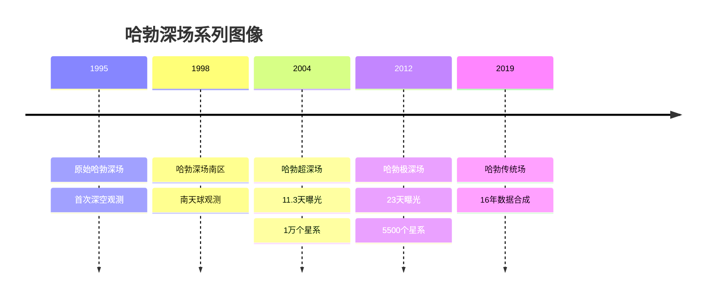

## 哈勃太空望远镜：改变我们看世界的方式

哈勃太空望远镜（Hubble Space Telescope, HST）自1990年发射以来，已经在太空中运行了超过30年，成为人类历史上最成功的科学仪器之一。它不仅为我们提供了无数令人惊叹的宇宙图像，更重要的是，它彻底改变了我们对宇宙的理解。

### 哈勃的重大科学发现

#### 1. 宇宙加速膨胀与暗能量

哈勃望远镜的观测数据帮助科学家们发现宇宙正在加速膨胀，这一发现导致了"暗能量"概念的提出，并最终为该领域的科学家赢得了2011年诺贝尔物理学奖。

#### 2. 确定宇宙年龄

通过测量遥远星系中的造父变星，哈勃帮助科学家们将宇宙年龄的估计精确到约138亿年，大大提高了我们对宇宙时间尺度的理解。

#### 3. 超大质量黑洞的普遍存在

哈勃的观测证实了几乎每个大型星系中心都存在超大质量黑洞，包括我们自己的银河系。

#### 4. 系外行星大气的首次探测

哈勃成为第一个直接探测系外行星大气成分的天文台，为寻找宜居行星奠定了基础。

### 哈勃深场：改变宇宙观的图像

1995年，哈勃团队将望远镜对准了一个看似"空白"的天区，持续曝光了10天，获得了著名的"哈勃深场"图像。这张图像揭示了超过3000个遥远的星系，其中一些形成于宇宙诞生后仅几亿年。



### 哈勃的技术遗产

哈勃望远镜的成功不仅在于其科学发现，还在于它推动了天文技术的发展：

1. **自适应光学技术**：哈勃的光学问题及其修复推动了自适应光学技术的发展，现在这项技术已广泛应用于地面望远镜。

2. **CCD相机技术**：哈勃使用的高精度CCD相机技术已经发展并应用到许多领域，包括医学成像。

3. **数据处理算法**：为处理哈勃数据而开发的图像处理算法现在被广泛应用于各种科学和工业领域。

### 哈勃图像处理技术

以下是处理哈勃原始数据的Python代码示例：

```python
import numpy as np
from astropy.io import fits
from astropy.visualization import make_lupton_rgb
import matplotlib.pyplot as plt
from astropy.visualization import astropy_mpl_style

# 设置天文学风格的绘图
plt.style.use(astropy_mpl_style)

def process_hubble_image(file_paths, output_path):
    """处理哈勃多波段图像并创建彩色合成图"""
    # 加载不同滤波器的图像
    images = []
    for file_path in file_paths:
        with fits.open(file_path) as hdul:
            # 获取主数据
            data = hdul[0].data.astype(np.float64)
            # 基本处理：减去背景，处理异常值
            bg = np.median(data)
            data -= bg
            # 将负值设为0
            data[data < 0] = 0
            # 标准化到0-1范围
            data_max = np.percentile(data, 99.5)  # 使用99.5百分位数避免极端值
            data /= data_max
            images.append(data)
    
    # 确保有三个通道用于RGB合成
    if len(images) >= 3:
        r, g, b = images[0], images[1], images[2]
    elif len(images) == 2:
        r, g = images[0], images[1]
        b = (r + g) / 2  # 创建合成蓝通道
    else:
        r = g = b = images[0]  # 灰度图像
    
    # 创建RGB图像
    rgb = make_lupton_rgb(r, g, b, stretch=5, Q=10)
    
    # 保存结果
    plt.figure(figsize=(10, 10))
    plt.imshow(rgb, origin='lower')
    plt.axis('off')
    plt.tight_layout()
    plt.savefig(output_path, dpi=300, bbox_inches='tight')
    plt.close()
    
    print(f"处理完成，图像已保存至: {output_path}")
    return rgb

# 使用示例
if __name__ == "__main__":
    # 哈勃深场图像文件路径（示例）
    files = [
        "hubble_data/hst_8162_01_acs_wfc_f850lp.fits",  # 红外波段
        "hubble_data/hst_8162_01_acs_wfc_f775w.fits",   # 红波段
        "hubble_data/hst_8162_01_acs_wfc_f606w.fits"    # 绿/蓝波段
    ]
    
    # 处理图像
    rgb_image = process_hubble_image(files, "hubble_deep_field_processed.png")
```

## 哈勃的未来与詹姆斯·韦伯太空望远镜

尽管哈勃已经运行了30多年，远超其设计寿命，但它仍在继续工作并提供宝贵的科学数据。同时，作为哈勃的继任者，詹姆斯·韦伯太空望远镜（JWST）已于2021年发射升空，并开始提供更深入的红外观测数据。

哈勃与韦伯望远镜的协同工作将为我们提供从紫外到中红外的全波段观测能力，开启天文学研究的新篇章。

### 哈勃与韦伯望远镜比较

| 特性 | 哈勃太空望远镜 | 詹姆斯·韦伯太空望远镜 |
|------|--------------|----------------------|
| 主镜直径 | 2.4米 | 6.5米 |
| 主要波段 | 紫外、可见光、近红外 | 近红外、中红外 |
| 轨道 | 近地轨道 | 日-地L2点 |
| 发射时间 | 1990年 | 2021年 |
| 设计寿命 | 15年 | 10年（目标） |
| 温度 | 常温 | 极低温（-233°C） |
| 主要科学目标 | 宇宙学、星系、恒星、行星 | 第一代星系、系外行星、恒星形成 |

## 参与哈勃遗产计划

作为天文爱好者或研究者，你可以通过以下方式参与哈勃遗产计划：

1. **访问哈勃数据档案**：所有哈勃数据在一定时间后都会公开，你可以访问[哈勃数据档案](https://archive.stsci.edu/hst/)获取原始观测数据。

2. **参与公民科学项目**：如[Galaxy Zoo](https://www.zooniverse.org/projects/zookeeper/galaxy-zoo/)等项目允许公众参与哈勃数据的分类和分析。

3. **使用哈勃图像进行科学传播**：哈勃的大多数图像都可以免费用于教育和非商业用途。

## 结语

哈勃太空望远镜不仅是一个科学仪器，更是人类探索精神的象征。它的遗产将永远铭刻在天文学的历史中，并继续激励未来几代人探索宇宙的奥秘。

在接下来的系列文章中，我们将深入探讨哈勃的具体科学发现、技术创新以及它对现代天文学的深远影响。