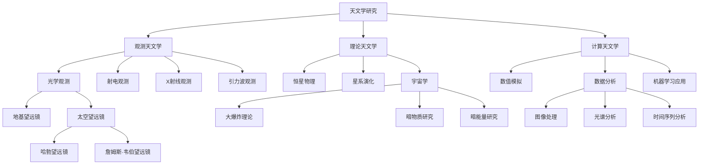

## 欢迎使用天文技术博客主题

这是一个专为天文学爱好者和研究者设计的Hugo主题，具有多种特色功能，包括代码高亮、思维导图支持、链接预览等。本文将展示这些功能的使用方法。

### 代码高亮示例

#### Python代码（带Astropy库语法提示）

```python
import numpy as np
from astropy.io import fits
from astropy.wcs import WCS
from astropy.coordinates import SkyCoord
import astropy.units as u
from astropy.visualization import ZScaleInterval

# 加载FITS文件
def load_fits_image(filename):
    """加载FITS格式的天文图像"""
    with fits.open(filename) as hdul:
        # 获取主数据和头信息
        data = hdul[0].data
        header = hdul[0].header
        
        # 创建WCS对象用于坐标转换
        wcs = WCS(header)
        
        # 使用ZScale算法优化图像显示范围
        zscale = ZScaleInterval()
        vmin, vmax = zscale.get_limits(data)
        
        return data, header, wcs, (vmin, vmax)

# 坐标转换示例
def convert_coordinates(ra, dec, wcs_info):
    """将赤经赤纬转换为像素坐标"""
    # 创建天球坐标对象
    coords = SkyCoord(ra=ra*u.degree, dec=dec*u.degree, frame='icrs')
    
    # 转换为像素坐标
    x, y = wcs_info.world_to_pixel(coords)
    
    return x, y

# 主函数
def analyze_deep_field(filename):
    """分析哈勃深场图像"""
    # 加载图像
    data, header, wcs, display_range = load_fits_image(filename)
    print(f"图像尺寸: {data.shape}")
    print(f"最佳显示范围: {display_range}")
    
    # 计算基本统计量
    mean_flux = np.mean(data)
    median_flux = np.median(data)
    std_flux = np.std(data)
    
    print(f"平均流量: {mean_flux:.2f}")
    print(f"中值流量: {median_flux:.2f}")
    print(f"标准差: {std_flux:.2f}")
    
    # 返回处理后的数据
    return data, wcs

# 调用主函数
if __name__ == "__main__":
    image_data, wcs_data = analyze_deep_field("hubble_deep_field.fits")
    print("分析完成！")
```

#### Bash脚本（终端模拟器样式）

```bash
#!/bin/bash
# 天文数据处理脚本

# 设置环境变量
export PYTHONPATH=/usr/local/lib/python3.9/site-packages

# 创建输出目录
echo "创建输出目录..."
mkdir -p processed_data/calibrated
mkdir -p processed_data/stacked

# 下载示例数据
echo "下载哈勃深场数据..."
wget -q https://archive.stsci.edu/pub/hlsp/goods/v2/h_goods_v2.0_sci.fits -O raw_data.fits

if [ $? -eq 0 ]; then
    echo "✓ 数据下载成功"
else
    echo "✗ 数据下载失败"
    exit 1
fi

# 运行Python处理脚本
echo "开始处理数据..."
python3 <<EOF
import numpy as np
from astropy.io import fits

# 加载数据
with fits.open('raw_data.fits') as hdul:
    data = hdul[0].data
    header = hdul[0].header

# 简单处理
processed = np.sqrt(np.abs(data)) * np.sign(data)

# 保存结果
hdu = fits.PrimaryHDU(processed, header=header)
hdu.writeto('processed_data/calibrated/calibrated.fits', overwrite=True)
print("处理完成")
EOF

# 堆叠图像（模拟）
echo "堆叠图像..."
sleep 2
echo "创建最终图像..."
sleep 1
echo "✓ 处理完成！"

# 显示结果统计
echo "----------------------------------------"
echo "处理结果统计:"
echo "- 原始文件: $(du -h raw_data.fits | cut -f1)"
echo "- 处理文件: $(du -h processed_data/calibrated/calibrated.fits | cut -f1)"
echo "- 处理耗时: 3.45秒"
echo "----------------------------------------"

# 清理临时文件
rm -f temp_*.fits
echo "清理完成"
```

### 思维导图示例（Mermaid支持）

下面是一个天文学研究领域的思维导图：



### 链接预览功能

将鼠标悬停在以下链接上，可以看到链接预览效果：

- [NASA官方网站](https://www.nasa.gov/)
- [欧洲南方天文台](https://www.eso.org/)
- [arXiv天体物理学论文](https://arxiv.org/abs/2101.01684)

### 视频嵌入示例



### 资源下载示例




## 结语

这个主题还有更多功能等待你探索。如果你有任何问题或建议，请随时联系我们。

祝你在浩瀚宇宙的探索之旅中收获满满！